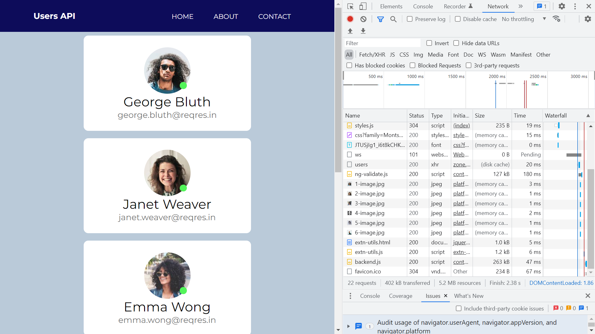

# :zap: Angular API Project

* App using a DataService with httpClient to get a JSON Observable data stream from an API and display it using the Angular async pipe.
* App also submits a simple Contact form.
* **Note:** to open web links in a new window use: _ctrl+click on link_


## :books: General info

* Routing module allows user to navigate between Home, About and Contact pages.
* API json/image data displayed: firstname, lastname, email and avatar.
* Angular FormBuilder used to allow user to submit a form with name and message. Form uses validation.
* Styling is pure SCSS

## :camera: Screenshots

.
.

## :signal_strength: Technologies

* [Angular v14](https://angular.io/)
* [RxJS Library v7](https://angular.io/guide/rx-library) used to [subscribe](http://reactivex.io/documentation/operators/subscribe.html) to the API data [observable](http://reactivex.io/documentation/observable.html).
* [The HttpClient in @angular/common/http](https://angular.io/guide/http) offers a simplified client HTTP API for Angular applications that rests on the XMLHttpRequest interface exposed by browsers.

## :floppy_disk: Setup

* Run `npm i` to install dependencies
* Run `ng serve` for a dev server. Navigate to `http://localhost:4200/`. The app will automatically reload if you change any of the source files.

## :computer: Code Examples

* `data.service.ts` ES6 arrow function to return observable from API using `apiResponse` interface

```typescript
getUsers = (): Observable<apiResponse> => {
  return this.http.get<apiResponse>("https://reqres.in/api/users");
}
```

* `home.component.ts` ng init. function to get observable data for the template async pipe - note: using an ES6 arrow function here would result in nothing being displayed, due the use of 'this'

```typescript
ngOnInit () {
  this.users$ = this.data.getUsers();
};
```


